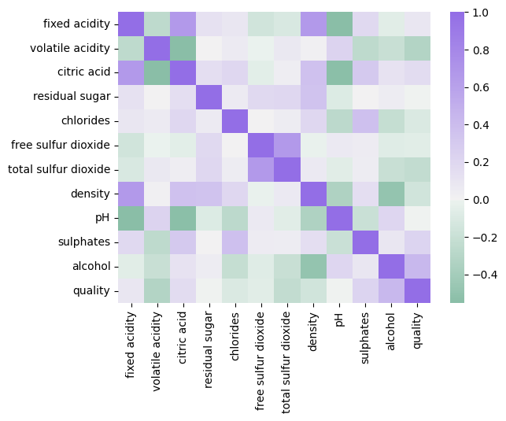
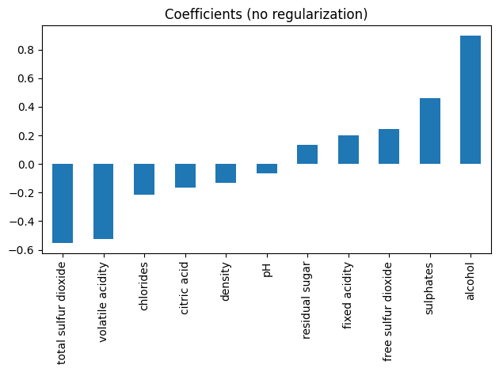
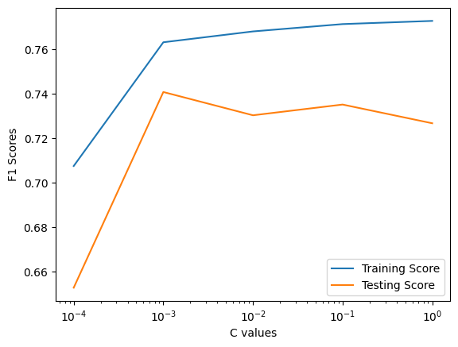

## Predicting Wine Quality with Regularization

The data we're working with is from the Wine Quality Dataset in the UCI Machine Learning Repository. We’re looking at the red wine data in particular and while the original dataset has a 1-10 rating for each wine, we’ve made it a classification problem with a wine quality of good (>5 rating) or bad (<=5 rating).

The goals of this project are to:

1. Implement different logistic regression classifiers
2. Find the best ridge-regularized classifier using hyperparameter tuning
3. Implement a tuned lasso-regularized feature selection method

### Main Features
- 11 input variables (based on physicochemical tests):
`fixed acidity`, `volatile acidity`, `citric acid`, `residual sugar`, `chlorides`, `free sulfur dioxide`, `total sulfur dioxide`, `density`, `pH`, `sulphates` and `alcohol`.

- An output variable, `quality` (0 for bad and 1 for good)

## WRITE UP
To fully see the effects of regularization predictions were made without regularization as control state, but before this, let's visualize the features and their correlations as its common for highly correlated features to go amiss in feature elimination. 

From the matrix we can see the pairs listed are highly correlated:
1. `fixed acidity` and `citric acid`
2. `fixed acidity` and `density`

1. Logistic regression without regularization
    - Training f1 score: 0.773
    - Testing f1 score: 0.7267

Model Coefficients before regularization can be seen in the following plot.

2. Logistic regression with default regularization(L2: Ridge reg.)
    - Ridge-regularized Training f1 score: 0.773
    - Ridge-regularized Testing f1 score: 0.7267

Turns out that the l2 regularization didn't do anything to change the model performance.

Let's plot the training and test scores to see if tuning the C parameter, inverse to the alpha paramter, will increase performance of the model. It looks like a c-value of around 0.001 gives optimal results. We can then conduct a fine grained tuning through C value arrays and employ the code below as a parameter grid for GridSearchCV

    
        C_array  = np.logspace(-4, -2, 100)
        tuning_C = {'C':C_array}
    

3. Logistic regression with Fine Grained Ridge regularization
    - Best C parameter : 0.00206
    - Ridge-regularized Training f1 score: 0.7725
    - Ridge-regularized Testing f1 score: 0.7352

Not much change has occured for the testing score so let's try Lasso Regularization.

4. Logistic regression with l1: Lasso regularization